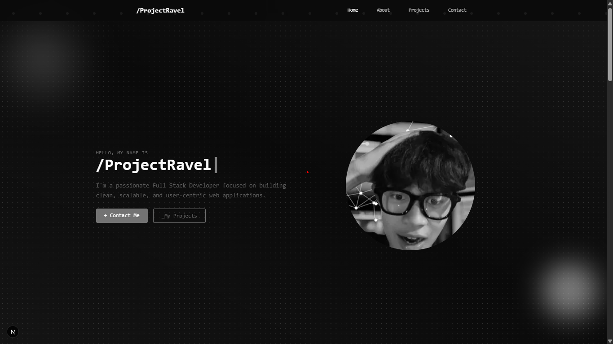

# ✨ Ravel Portfolio



This is a personal portfolio project built with [Next.js](https://nextjs.org), designed to showcase work, experience, and personal information in a modern, responsive, and interactive layout.

---

## 🚀 Getting Started

Run the development server:

```bash
npm run dev

# or

yarn dev

# or

pnpm dev

# or

bun dev
```

Then open [http://localhost:3000](http://localhost:3000) in your browser.

---

## 🛠️ Tech Stack

- [Next.js](https://nextjs.org) — React framework for production
- [TypeScript](https://www.typescriptlang.org/) — Strongly typed JavaScript
- [Tailwind CSS](https://tailwindcss.com) — Utility-first CSS framework
- [ShadCN/UI](https://ui.shadcn.com) — Beautiful UI components using Radix and Tailwind
- [next/font](https://nextjs.org/docs/app/building-your-application/optimizing/fonts) — Font optimization
- [Geist Font](https://vercel.com/font) — Official Vercel font

---

## 📁 Project Structure

\`\`\`bash
app/ # App router and page structure
components/ # Reusable UI components
public/images/ # Static assets like images (including screenshots)
styles/ # Global CSS styles
\`\`\`

---

## 📚 Learn More

- [Next.js Documentation](https://nextjs.org/docs)
- [Interactive Next.js Tutorial](https://nextjs.org/learn)
- [Next.js GitHub Repository](https://github.com/vercel/next.js)

---

## 📦 Deploy to Vercel

Easiest way to deploy this project is via [Vercel](https://vercel.com), creators of Next.js:

[](https://vercel.com/new?utm_source=create-next-app&utm_medium=default-template&utm_campaign=create-next-app)

EOF
